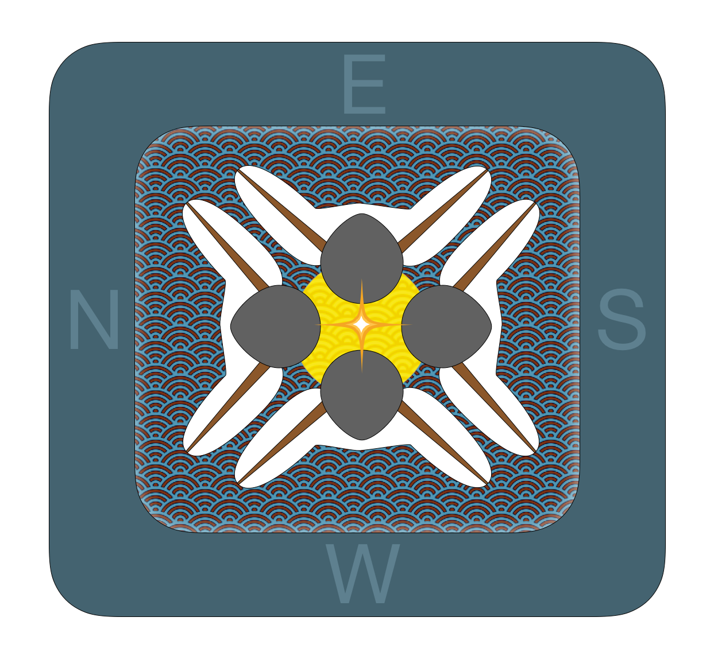
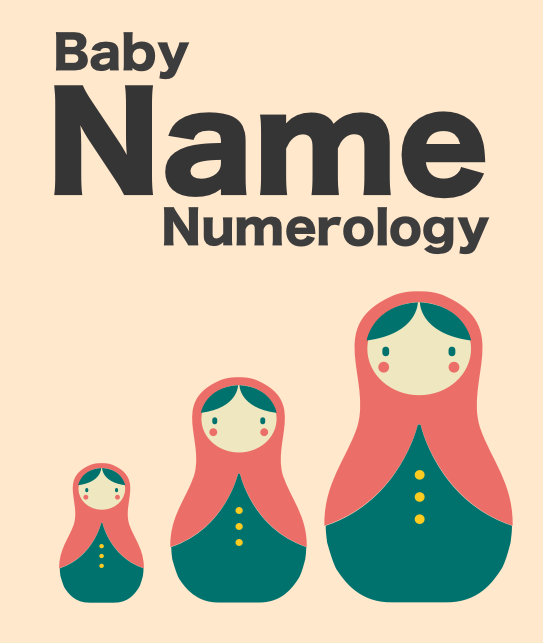

# Artboards

This is an autogenerated file showing all the artboards. Do not edit it directly.

## A4 Copy 2

## A4 Copy 3

## A4 Copy 4

## A4 Copy 5

## A4 Copy

## A4

## Artboard

## Baby Name

## Business Name

## Color Palette

## Fonts

## Gems

## NameNumerology Copy

## NameNumerology

## Spirit 1

## Spirit 2

## Spirit 3

## Spirit 4

## Spirit

## Text Styles

## Which Spirit is Celebrating

## logo final

## logo idea

## meditate

